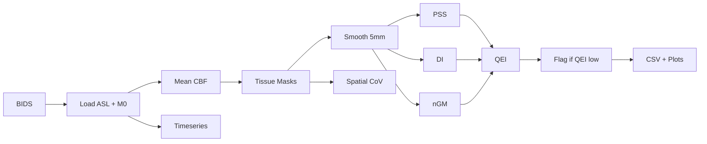
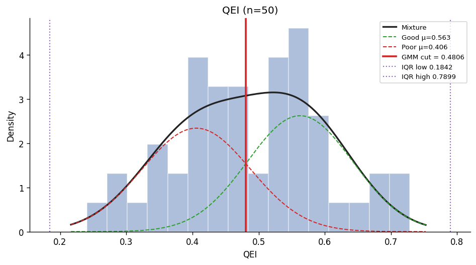
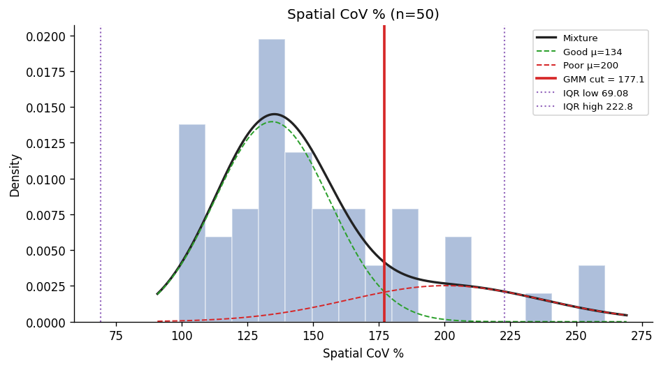

# Quality Check Toolbox v1.0

A Python toolbox for **automated Quality Control (QC) of Arterial Spin Labeling (ASL) MRI data** on BIDS-formatted datasets.

*Developed as part of a GSoC project for Quality Check Toolbox v1.0.*

> *Automated Quality Evaluation Index for Arterial Spin Labeling Derived Cerebral Blood Flow Maps.*
> Dolui et al., JMRI 2024. [doi:10.1002/jmri.29308](https://doi.org/10.1002/jmri.29308)

---

## Pipeline Flow



---

## What is ASL and why QC matters

**Arterial Spin Labeling (ASL)** measures cerebral blood flow non-invasively. ASL CBF maps are sensitive to motion, low SNR, incomplete labelling, and noise. **QEI** summarizes quality in a single score in [0, 1].

---

## QC Metrics

### QEI — Quality Evaluation Index

Composite score in [0, 1] from three independent failure modes. Uses ASLPrep empirical coefficients:

```
QEI = ∛( (1 - exp(α·ρ_ss^β)) · exp(-(γ·DI^δ + ε·nGMCBF^ζ)) )
α=-3.0126, β=2.4419, γ=0.054, δ=0.9272, ε=2.8478, ζ=0.5196
```

| Variable | Component | Description |
|----------|-----------|-------------|
| **ρ_ss (PSS)** | Pseudo-Structural Similarity | Pearson correlation between CBF and pseudo-structural CBF (2.5×GM + 1×WM). Low = spatial pattern destroyed by noise/artefacts |
| **DI** | Index of Dispersion | Within-tissue pooled variance / \|mean GM CBF\|. High = motion or incomplete labelling |
| **nGMCBF** | Negative GM fraction | Fraction of GM voxels with negative CBF (physiologically implausible → artefact) |

CBF is smoothed at 5 mm FWHM before QEI computation.

### Additional metrics (per subject)

| Metric | Description |
|--------|--------------|
| **mean_gm_cbf** | Mean CBF in grey matter (ml/100g/min) |
| **median_gm_cbf** | Median CBF in grey matter |
| **std_gm_cbf** | Standard deviation of CBF in GM |
| **spatial_cov** | Spatial coefficient of variation in GM: 100 × σ/μ (%) — sensitive to vascular artefacts |
| **n_volumes** | Number of ASL volumes (control + label) |
| **raw_timeseries** | Mean whole-brain signal per volume (for control-label pattern inspection) |

---

## Project Structure

```
Quality-Check-Toolbox/
├── qc_toolbox/
│   ├── qei.py           # QEI computation (Dolui et al. 2024)
│   ├── bids_loader.py   # BIDS-format ASL data loader
│   ├── tissue_masks.py  # Tissue mask derivation from CBF maps
│   ├── pipeline.py      # Main QC pipeline runner
│   ├── visualize.py            # Plots & console report
│   ├── live_html.py            # Live HTML dashboard
│   └── threshold_derivation.py # GMM / IQR cohort thresholds
├── scripts/
│   ├── derive_thresholds.py
│   └── adni_to_bids_asl.py
├── run_pipeline.py
├── docs/images/          # example threshold figures (below)
├── requirements.txt
└── README.md
```

---

## Real-data pipeline

### 1. Install dependencies

```bash
pip install -r requirements.txt
```

### 2. ExploreASL test dataset (optional)

```bash
git clone --depth 1 https://github.com/ExploreASL/ExploreASL data/ExploreASL
```

ASL BIDS data for the smoke test: `data/ExploreASL/External/TestDataSet/rawdata`.

### 3. Run QC on the test dataset

```bash
python run_pipeline.py run \
  --bids ./data/ExploreASL/External/TestDataSet/rawdata \
  --output ./qc_output
```

**Outputs**

- `qc_output/qc_results.csv` — QEI, PSS, DI, n_gm, mean/median/std GM, spatial CoV, n_volumes, flags, etc.
- `qc_output/qc_summary.png` — four-panel cohort summary (QEI, PSS, mean GM, spatial CoV)

### 4. Custom thresholds (optional)

```bash
python run_pipeline.py run \
  --bids ./data/ExploreASL/External/TestDataSet/rawdata \
  --output ./qc_output \
  --qei-min 0.65 \
  --mean-gm-min 20 \
  --mean-gm-max 80
```

Use **`--strict-qcbf`** when the input map is true quantified CBF (ml/100g/min) instead of the default mean control−label proxy.

### 5. Live HTML dashboard (optional)

```bash
python run_pipeline.py run \
  --bids ./data/ExploreASL/External/TestDataSet/rawdata \
  --output ./qc_output \
  --live-html
```

Writes **`qc_live_run.html`** in the current working directory (CBF slices, histograms, control–label timeseries, QEI).

### 6. Your own BIDS dataset

```bash
python run_pipeline.py run --bids /path/to/my_bids_dataset --output ./qc_output
```

### 7. ADNI DICOM → BIDS `perf/` (optional)

If downloads use ADNI’s native folders, convert with **`scripts/adni_to_bids_asl.py`** (requires **[dcm2niix](https://github.com/rordenlab/dcm2niix)** on `PATH`):

```bash
python scripts/adni_to_bids_asl.py \
  --adni /path/to/ADNI_native_root \
  --bids /path/to/ADNI_BIDS_output \
  --dcm2niix dcm2niix
```

Dry-run (list DICOM folders only): add **`--dry-run`**.

---

## Pass / fail

**Only QEI** sets `flagged` in the CSV. PSS, DI, and n_gm are stored for diagnosis but not separately thresholded (they feed QEI).

| Preset | Rule |
|--------|------|
| **Default** | QEI ≥ 0.30 |
| **`--strict-qcbf`** | QEI ≥ 0.70 and mean GM map in 10–120 ml/100g/min |

---

## Threshold derivation (GMM vs IQR)

After `qc_results.csv` exists for a cohort, `scripts/derive_thresholds.py` fits a **two-component Gaussian mixture** and draws the threshold at the **PDF crossing** between the two modes (“valley”). **Tukey IQR fences** (Q1 − 1.5×IQR, Q3 + 1.5×IQR) are overlaid for comparison. Default metrics: **QEI** and **spatial CoV**. Outputs include `qei_gmm_iqr.png`, `spatial_cov_gmm_iqr.png`, `threshold_report.md`, and `threshold_report.json` (≥10 subjects per metric recommended).

### Example: ADNI BIDS cohort (n = 50)

The figures below come from threshold derivation run on **50 ASL MRI scans** on **Siemens 3 T** MRI systems (**three-Tesla** main magnetic field), **baseline** test data, with **homogeneous acquisition** across subjects (supporting cohort-level GMM/IQR thresholding). Data were prepared as BIDS ASL (e.g. converted ADNI perfusion). Check [ADNI](https://adni.loni.usc.edu/) policies before redistributing cohort-derived plots.

| QEI | Spatial CoV |
|-----|-------------|
|  |  |

*Red vertical: GMM cut. Purple dotted: IQR fences. Black: mixture PDF; dashed: mixture components.*

```bash
python scripts/derive_thresholds.py \
  --csv qc_output/qc_results.csv \
  --output qc_output/threshold_analysis
```

**Requirements:** `scikit-learn` (listed in `requirements.txt`). At least **~10 subjects** per metric; more is better for a stable GMM.

**Options**

- **`--metrics qei spatial_cov`** — default if omitted (QEI + spatial CoV only).
- **`--metrics qei spatial_cov pss di n_gm`** — include QEI components for exploratory fits.
- **`--seed N`** — GMM random seed (default 0).

---

## References

| Resource | Link |
|----------|------|
| QEI (Dolui et al. 2024) | [doi:10.1002/jmri.29308](https://doi.org/10.1002/jmri.29308) |
| ASLPrep | [github.com/PennLINC/aslprep](https://github.com/PennLINC/aslprep) |
| BIDS ASL | [bids-specification](https://bids-specification.readthedocs.io) |
| ExploreASL | [github.com/ExploreASL/ExploreASL](https://github.com/ExploreASL/ExploreASL) |
| OpenNeuro | [openneuro.org](https://openneuro.org) |
