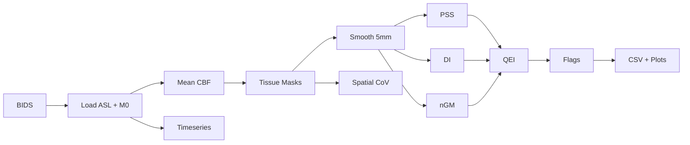

# Quality Check Toolbox v1.0

A Python toolbox for **automated Quality Control (QC) of Arterial Spin Labeling (ASL) MRI data**, featuring a full real-data pipeline for BIDS-formatted datasets.

*This project is developed as part of a GSoC proposal for Quality Check Toolbox v1.0.*

> *Automated Quality Evaluation Index for Arterial Spin Labeling Derived Cerebral Blood Flow Maps.*
> Dolui et al., JMRI 2024. [doi:10.1002/jmri.29308](https://doi.org/10.1002/jmri.29308)

---

## Pipeline Flow



---

## What is ASL and why does QC matter?

**Arterial Spin Labeling (ASL)** is an MRI technique that measures cerebral blood flow (CBF) non-invasively by magnetically labelling water in blood as it enters the brain. It is widely used in studies of Alzheimer's disease, stroke, and other neurological conditions.

ASL CBF maps are however prone to:
- **Motion artefacts** — patient movement between label/control pairs
- **Low SNR** — only ~1% of the signal comes from labelled blood
- **Incomplete labelling** — when blood arrives late, CBF appears artificially low or negative
- **Noise** — poor shimming, RF inhomogeneity

Manual quality rating by radiologists is gold-standard but slow and subjective. **QEI automates this** with a single scalar score in [0, 1].

---

## QC Metrics

### QEI — Quality Evaluation Index

Composite score in [0, 1] from three independent failure modes. Uses ASLPrep empirical coefficients:

```
QEI = ∛( (1 - exp(α·ρ_ss^β)) · exp(-(γ·DI^δ + ε·nGMCBF^ζ)) )
α=-3.0126, β=2.4419, γ=0.054, δ=0.9272, ε=2.8478, ζ=0.5196
```

| Variable | Component | Description |
|----------|-----------|-------------|
| **ρ_ss (PSS)** | Pseudo-Structural Similarity | Pearson correlation between CBF and pseudo-structural CBF (2.5×GM + 1×WM). Low = spatial pattern destroyed by noise/artefacts |
| **DI** | Index of Dispersion | Within-tissue pooled variance / \|mean GM CBF\|. High = motion or incomplete labelling |
| **nGMCBF** | Negative GM fraction | Fraction of GM voxels with negative CBF (physiologically implausible → artefact) |

CBF is smoothed at 5 mm FWHM before QEI computation.

### Additional metrics (per subject)

| Metric | Description |
|--------|--------------|
| **mean_gm_cbf** | Mean CBF in grey matter (ml/100g/min) |
| **median_gm_cbf** | Median CBF in grey matter |
| **std_gm_cbf** | Standard deviation of CBF in GM |
| **spatial_cov** | Spatial coefficient of variation in GM: 100 × σ/μ (%) — sensitive to vascular artefacts |
| **n_volumes** | Number of ASL volumes (control + label) |
| **raw_timeseries** | Mean whole-brain signal per volume (for control-label pattern inspection) |

---

## Project Structure

```
Quality-Check-Toolbox/
├── qc_toolbox/
│   ├── qei.py           # QEI computation (Dolui et al. 2024)
│   ├── bids_loader.py   # BIDS-format ASL data loader
│   ├── tissue_masks.py  # Tissue mask derivation from CBF maps
│   ├── pipeline.py      # Main QC pipeline runner
│   ├── visualize.py     # Plots & console report
│   └── live_html.py     # Live HTML dashboard generator
├── run_pipeline.py      # CLI entry point
├── qc_live_run.html     # Generated live dashboard (with --live-html)
├── requirements.txt
└── README.md
```

---

## Real-Data Pipeline

### 1. Install dependencies

```bash
pip install -r requirements.txt
```

### 2. Get the ExploreASL TestDataSet

Clone the ExploreASL repository to get access to their `TestDataSet`:

```bash
git clone --depth 1 https://github.com/ExploreASL/ExploreASL data/ExploreASL
```

### 3. Run QC pipeline using ExploreASL TestDataSet

```bash
python run_pipeline.py run --bids ./data/ExploreASL/External/TestDataSet/rawdata --output ./qc_output
```

**Output:**
- `qc_output/qc_results.csv` — per-subject QEI, PSS, DI, nGM, mean/median/std GM CBF, spatial CoV, n_volumes, flags
- `qc_output/qc_summary.png` — 4-panel distribution plot (QEI, PSS, mean GM CBF, spatial CoV)

### 4. Custom thresholds (optional)

```bash
# Pediatric or clinical population with different physiology
python run_pipeline.py run \
    --bids ./data/ExploreASL/External/TestDataSet/rawdata \
    --output ./qc_output \
    --qei-min 0.65 \
    --mean-gm-min 20 \
    --mean-gm-max 80
```

### 5. Live HTML dashboard (optional)

Generate a standalone HTML dashboard that updates as subjects are processed:

```bash
python run_pipeline.py run --bids ./data/ExploreASL/External/TestDataSet/rawdata \
    --output ./qc_output --live-html
```

Creates `qc_live_run.html` in the current directory with CBF slices, histograms, control-label timeseries, and QEI scores.

### 6. Run on your own BIDS data (skip download)

```bash
python run_pipeline.py run --bids /path/to/my_bids_dataset --output ./qc_output
```

---

## Default QC Thresholds

| Metric | Threshold | Rationale |
|--------|-----------|-----------|
| QEI | ≥ 0.70 | Dolui et al. 2024 recommended pass threshold |
| PSS | ≥ 0.40 | Low structural similarity = spatial artefacts |
| DI | ≤ 2.00 | High DI = noise or motion dominance |
| neg GM fraction | ≤ 0.10 | >10% negative GM CBF = severe artefact |
| Mean GM CBF | 10–120 ml/100g/min | Physiological plausibility range |

---

## Learn more

| Resource | Link |
|----------|------|
| QEI paper (Dolui et al. 2024) | [doi:10.1002/jmri.29308](https://doi.org/10.1002/jmri.29308) |
| ASLPrep | [ASLPrep on GitHub](https://github.com/PennLINC/aslprep) |
| BIDS ASL specification | [BIDS ASL Extension](https://bids-specification.readthedocs.io) |
| OpenNeuro datasets | [openneuro.org](https://openneuro.org) |
| ExploreASL QC toolbox | [ExploreASL on GitHub](https://github.com/ExploreASL/ExploreASL) |
